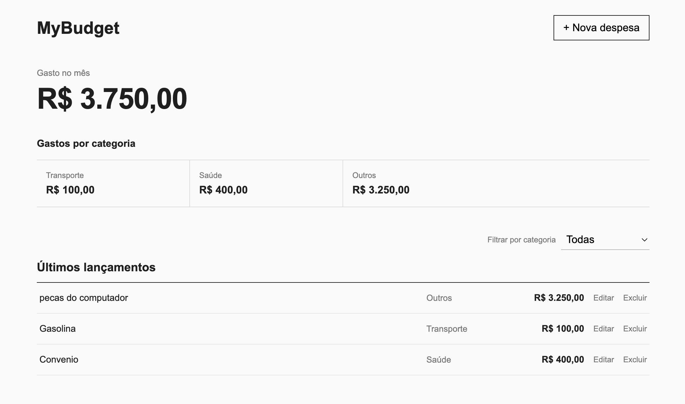

# MyBudget

Aplicação simples para controle de despesas pessoais desenvolvida com React.

## Preview



## Funcionalidades

- Cadastro de despesas
- Edição de despesas
- Exclusão de despesas
- Filtro por categoria
- Cálculo do total de gastos
- Resumo por categoria
- Persistência dos dados com localStorage
- Layout responsivo

## Tecnologias

- React
- JavaScript
- CSS
- Vite

## Como executar

```bash
Clone o repositório:

git clone URL-DO-REPOSITORIO

Entre na pasta:

cd "..."

Instale as dependências:

npm install

Inicie o projeto:

npm run dev Sobre o projeto
